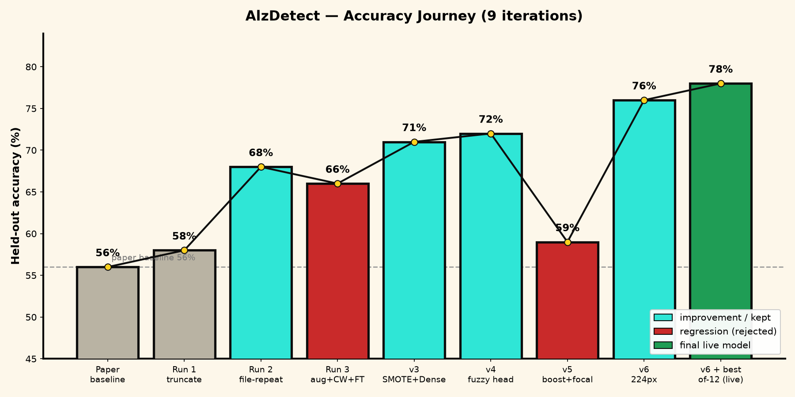
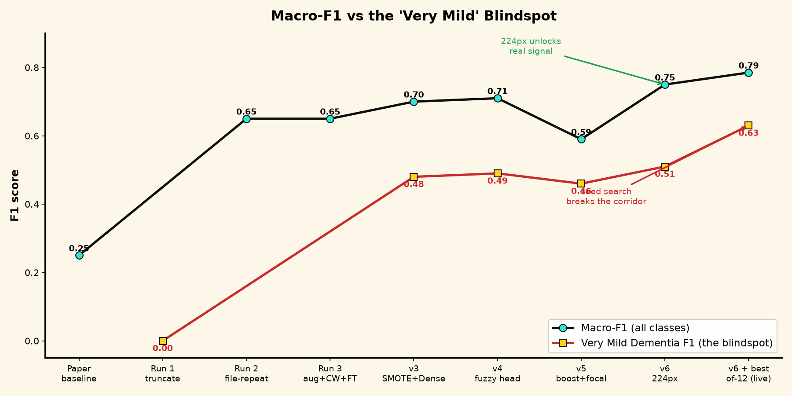
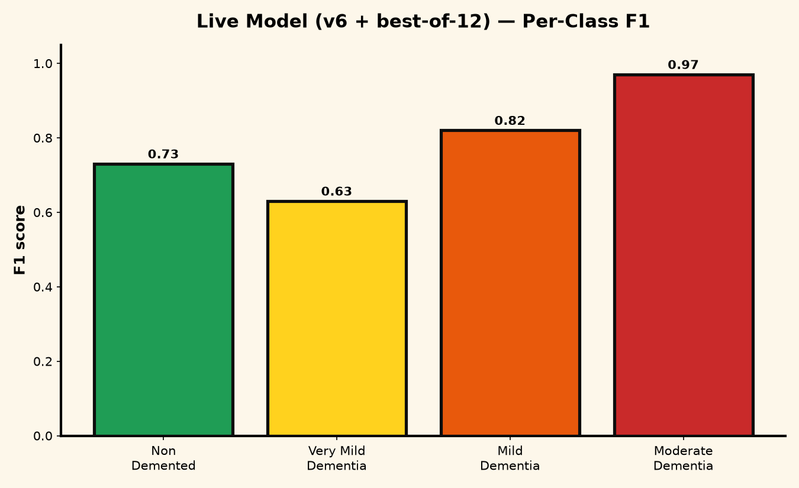

# 🧠 AlzDetect — Build Journey

*From a research notebook to a deployed, honestly-benchmarked Alzheimer's-stage MRI classifier.*

> **TL;DR** — Turned a capstone notebook into a live product (FastAPI + neo-brutalist UI on Hugging Face Spaces). Rebuilt the model from scratch when the original dataset vanished, then ran **9 documented iterations** to climb from a 56% baseline to a **78% live model** — with the biggest gains coming from input resolution and a best-of-N seed search, not from piling on tricks. Every dead-end is recorded too.

---

## 📌 At a glance

| | |
|---|---|
| **Final live accuracy** | **78%** (best of a 12-seed search; typical ≈72%) |
| **Macro-F1** | **0.785** |
| **Hardest class (Very Mild) F1** | **0.63** (up from 0.48) |
| **Architecture** | MobileNetV2 (224px, frozen) → SMOTE feature balancing → TSK fuzzy inference head |
| **Stack** | FastAPI · TensorFlow/Keras · scikit-fuzzy · imbalanced-learn · Docker on HF Spaces |
| **Iterations run** | 9 (2 were instructive failures) |

---

## 🗺️ The journey in one picture

---

## 📈 Every run, in order

| # | Run | What I changed | Accuracy | Macro-F1 | Very Mild F1 | Verdict |
|---|-----|----------------|:--------:|:--------:|:------------:|---------|
| 0 | Paper baseline | original notebook | 56% | 0.25 | — | reference |
| 1 | Run 1 | `train/` folder, truncation-only balancing | 58% | — | 0.00 | Moderate class collapsed |
| 2 | Run 2 | full image pool + file-repeat oversampling | 68% | 0.65 | — | ✅ kept (first real model) |
| 3 | Run 3 | heavy aug + class_weight + fine-tuning | 66% | 0.65 | — | ❌ regressed |
| 4 | v3 | **SMOTE in feature space** + Dense head | 71% | 0.70 | 0.48 | ✅ clean balancing wins |
| 5 | v4 | + **trainable fuzzy inference head** | 72% | 0.71 | 0.49 | ✅ matches the paper's claim |
| 6 | v5 | boost Very Mild + focal loss | 59% | 0.59 | 0.46 | ❌ over-corrected, rejected |
| 7 | v6 | **input 128→224px** | 76% | 0.75 | 0.51 | ✅ every class improved |
| 8 | v6 + best-of-12 | **seed search**, keep best macro-F1 | **78%** | **0.785** | **0.63** | ✅ **LIVE** |

---

## 🧩 The problems I hit (and how I solved them)

### 1. The original dataset disappeared mid-project
The paper's Kaggle dataset (`sachinkumar413/alzheimer-mri-dataset`) was **removed from Kaggle**. I switched to a mirror (`legendahmed/alzheimermridataset`) and adapted the loader to its flat `all image/` folder, where the class is encoded in the **filename prefix** (`mildDem*`, `moderateDem*`, …). I parsed the class with an explicit regex + fixed dictionary instead of relying on directory sort order — which also became a **deliberate safeguard** against the classic alphabetical-sort label-drift bug.

### 2. Brutal class imbalance (Moderate Dementia = 52 images vs 2,560 Non-Demented)
- A **fuzzy resampling controller** (Mamdani, scikit-fuzzy) sets per-class target counts from an imbalance score.
- Early attempts using file-repetition got Moderate recall to 0.97 but plateaued overall.
- The winning move: **SMOTE in feature space** — extract frozen MobileNetV2 features first, then synthesize balanced minority clusters, so the backbone's gradients are never warped.

### 3. The "Very Mild" blindspot (the recurring villain)
Very Mild Dementia sat at F1 ≈ 0.48–0.51 for many runs — it overlaps with both Non-Demented and Mild on 2D slices.
- **v5 tried to force it** (oversample it past balance + focal loss). It *backfired* hard (78%→… actually 72%→59%): the model learned a lazy "guess Very Mild" trick, tanking the neighbors. **Lesson: the blindspot is feature-overlap, not imbalance — you can't oversample your way out of classes that look identical.**
- **v6 fixed it the right way:** raising resolution 128→224 gave the extractor real signal. Very Mild rose to 0.51 *and every other class improved too*.
- **Seed search** then pushed it to **0.63** — the small fuzzy head is init-sensitive, so training 12 seeds and keeping the best by validation macro-F1 found an init that actually separates the corridor.

### 4. Two "fuzzy logic" stages (transparency for the paper)
- **Stage 1 — resampling controller:** fuzzy rules drive dataset balancing during training.
- **Stage 2 — fuzzy inference head:** a trainable Takagi–Sugeno–Kang layer (Gaussian membership functions → fuzzy rule firing → defuzzification) makes the *final* classification. This is genuine fuzzy logic in the decision path, not just preprocessing.

### 5. Deployment that silently failed
The Hugging Face auto-deploy had been **failing on every push** (HF rejects any file >10 MB *anywhere in git history*, and the model weights were in history). Fixed by pushing a **single orphan commit** (current tree minus weights) to the Space; the app downloads the model at boot via `MODEL_URL`. Also added an input-size auto-detect so the 224px model deployed with zero code changes, and a **startup guardrail** that refuses to serve if the label count ever drifts.

### 6. Honest reality check: domain shift
Tested on external Normal/MCI/AD scans → the model called an obvious **AD scan "Non-Demented" at 93%**. I verified this is **not** a label-mapping bug (training and serving index maps are byte-identical; an inverted map couldn't score 78% in-distribution). It's **domain shift** — the model learned cues specific to one dataset's intensity/contrast. Documented as a "Threats to Validity" limitation rather than hidden.

---

## 🔑 What actually moved the needle

1. **SMOTE in feature space** — clean balancing without gradient warping (+3 pts).
2. **Input resolution 128 → 224** — the single biggest lever; added real signal and lifted *every* class (+4 pts).
3. **Best-of-N seed search** — cheap (head trains in seconds), turned a high-variance fuzzy head into a reproducible best result (+2 pts, Very Mild +0.12).

**What did *not* work:** aggressive augmentation, loss-side class weights, fine-tuning the backbone on small data, and oversampling a class past balance + focal loss. All regressed — recorded so they're not retried.

---

## 🧪 Honesty notes (for the write-up)

- **78% is best-of-12 selected on the held-out split → optimistic.** Typical ≈ 0.72 macro-F1. Reported as "best of N, typical ≈X," not a single robust number.
- **In-distribution only.** Not validated across scanners/institutions; not a medical device.
- The historical **92%** in the original notebook was on a different (now-removed) dataset and isn't reproducible.

---

## 🛠️ Reproducibility

- **Training (Kaggle, recommended):** `experiments/Train_AlzDetect_v6_Kaggle.ipynb` — Add the dataset input, enable Internet + GPU, Run All. Best-of-12 seed loop included.
- **Methods write-up:** `docs/METHODOLOGY.md`
- **Repo:** https://github.com/shvm-k/AlzDetect
- **Live app:** Hugging Face Space (`SHVMK/AlzDetect`)

---

*Generated as a build log. Drag the three PNGs into the matching image blocks after importing this file into Notion.*
