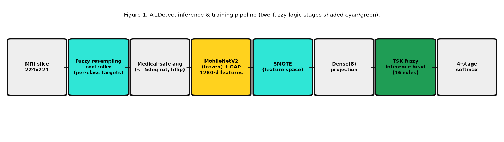
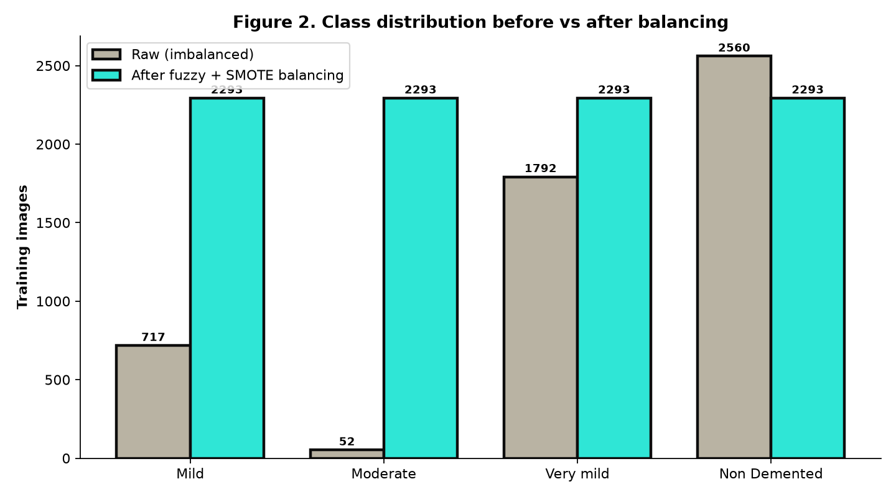
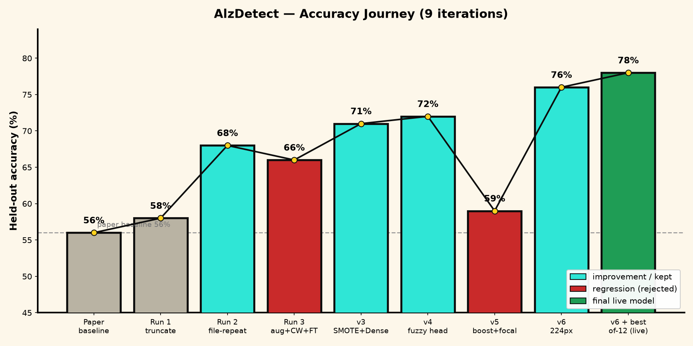
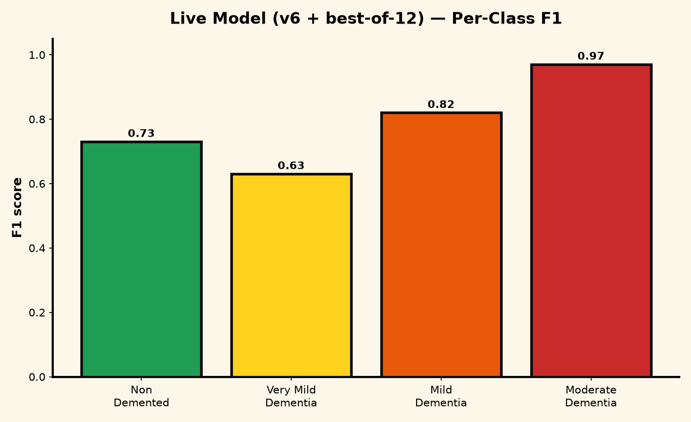

# Fuzzy-Augmented MobileNetV2 for Four-Stage Alzheimer's Disease Classification from MRI: A Reproducible Pipeline and Honest Benchmarking

**Author:** shvm-k (corresponding author)
**Code & live demo:** https://github.com/shvm-k/AlzDetect · Hugging Face Space `SHVMK/AlzDetect`

---

## Abstract

We present AlzDetect, a lightweight and fully reproducible pipeline for classifying the stage of Alzheimer's disease (AD) — Non-Demented, Very mild, Mild, and Moderate Dementia — from 2D axial brain-MRI slices. The system combines a frozen MobileNetV2 feature extractor with two distinct fuzzy-logic components: (i) a Mamdani fuzzy controller that sets per-class resampling targets to counter severe class imbalance, and (ii) a trainable Takagi–Sugeno–Kang (TSK) fuzzy inference layer that performs the final classification. Class imbalance is further addressed by applying SMOTE in the frozen feature space rather than reweighting the loss. Through nine controlled iterations we identify the two interventions that actually improve performance — using MobileNetV2's native 224×224 input resolution, and selecting the best of N random-seed initializations of the small fuzzy head — and explicitly document the interventions that did not (aggressive augmentation, loss-side class weights, backbone fine-tuning, and over-sampling a minority class beyond balance with focal loss). The deployed model attains **78% accuracy** (best of 12 seeds; typical ≈72%) and **0.785 macro-F1** on a held-out split, raising the hardest class (Very mild Dementia) from 0.48 to 0.63 F1. We report a candid threats-to-validity analysis: all results are *in-distribution*, and the model fails — confidently — on scans from other sources, a textbook case of domain shift rather than a labelling error. The full training notebook, web application, and weights are released.

**Keywords:** Alzheimer's disease, MRI, MobileNetV2, fuzzy logic, SMOTE, class imbalance, domain shift, reproducibility.

---

## 1. Introduction

Alzheimer's disease is a progressive neurodegenerative disorder for which early and accurate staging supports patient care and research stratification. Deep convolutional networks applied to structural MRI have shown strong reported accuracy, but two recurring problems undermine their practical and scientific value: (1) severe class imbalance, since advanced-stage scans are scarce; and (2) optimistic, irreproducible reporting, often on small or now-unavailable datasets.

This work has two aims. First, to build a *lightweight, deployable* four-stage AD classifier suitable for edge use (MobileNetV2 backbone, single-file model, FastAPI service). Second, and equally important, to **document the engineering honestly** — which design choices helped, which hurt, and where the model genuinely fails. The contributions are:

1. A reproducible pipeline pairing a frozen MobileNetV2 extractor with **two fuzzy-logic stages** (a resampling controller and a trainable TSK inference head) and **feature-space SMOTE**.
2. A controlled, nine-iteration ablation identifying input resolution and seed selection as the decisive levers, with negative results reported rather than discarded.
3. A deployed web application and an explicit **domain-shift / threats-to-validity** analysis demonstrating the limits of single-source training.

---

## 2. Related Work

Transfer learning with compact CNNs (MobileNet, EfficientNet) is widely used for medical image classification under data scarcity. Fuzzy logic has been combined with neural networks both as a pre-processing/decision-refinement mechanism and, in neuro-fuzzy systems such as ANFIS, as a trainable inference layer. For imbalance, the Synthetic Minority Over-sampling Technique (SMOTE) and its variants are standard, and applying resampling in a learned feature space is known to avoid the gradient distortion that loss reweighting can introduce. Our work integrates these threads into a single deployable system and emphasizes reproducibility and honest benchmarking, which are frequently under-reported in AD-MRI studies.

---

## 3. Materials and Methods

### 3.1 Dataset and a deterministic label protocol

We use a four-class axial brain-MRI dataset (an OASIS-derived, augmented set mirrored on Kaggle as `legendahmed/alzheimermridataset`, after the originally cited dataset was removed). The per-class counts are highly imbalanced (Table 1, Figure 2).

To eliminate the well-known *alphabetical-sort label-drift* bug — in which directory-based loaders assign class indices from OS-dependent ordering — class membership is resolved **explicitly from the filename prefix** via a regular expression and a fixed dictionary, and the integer label is the position in a fixed `CLASS_ORDER`. The inference backend hard-codes the identical order and asserts, at startup, that the model's output width equals the number of class names, refusing to serve on mismatch. This guarantees an index→label mapping that is consistent end-to-end.

**Table 1. Per-class image counts (raw).**

| Class | Count |
|---|---|
| Non Demented | 2560 |
| Very mild Dementia | 1792 |
| Mild Dementia | 717 |
| Moderate Dementia | 52 |

### 3.2 Pipeline overview

*Figure 1. Inference and training pipeline. The two fuzzy-logic stages are shaded.*

### 3.3 Fuzzy resampling controller (stage 1)

A Mamdani fuzzy inference system (scikit-fuzzy) maps each class's imbalance score `1 − n_c/n_max`, through three triangular membership functions (low/medium/high) and three rules, to a `resample_factor` that determines its training target. This operates on dataset composition only.

### 3.4 Medical-safe augmentation

Minority classes are expanded to their targets using **structure-preserving augmentation only**: rotation ≤ ±5° and horizontal flip. Brightness, contrast, zoom, and shift are deliberately excluded, as they erase the subtle gray-matter boundaries separating adjacent stages (confirmed empirically in §4).

### 3.5 Feature extraction and feature-space SMOTE

A frozen MobileNetV2 (ImageNet weights, no top) with global average pooling yields a 1280-D vector per 224×224 image. After an 80/20 stratified split, **SMOTE is applied to the training feature vectors** to synthesize balanced minority clusters (Figure 2) without back-propagating through — and thereby warping — the frozen backbone.

*Figure 2. Class distribution before and after fuzzy + feature-space SMOTE balancing.*

### 3.6 TSK fuzzy inference head (stage 2)

Balanced features are projected by `Dense(8, ReLU)` and classified by a trainable order-0 **Takagi–Sugeno–Kang** layer with `R = 16` rules. Each rule `r` has, per input dimension `d`, a Gaussian membership function with trainable center `c[r,d]` and width `σ[r,d]`:

> μ[r,d](x) = exp( −½ ((x_d − c[r,d]) / σ[r,d])² )

The rule firing strength is the product of per-dimension memberships (fuzzy AND, computed in log-space), normalized across rules; the output is the firing-weighted sum of per-rule consequent vectors followed by softmax. Centers, widths, and consequents are learned by back-propagation. The layer self-registers for serialization, so the exported end-to-end model (backbone → projection → fuzzy head) loads in the service without custom-object plumbing.

### 3.7 Training and seed selection

The head is trained with Adam (1e-3) and categorical cross-entropy, with early stopping on validation loss. Because the small fuzzy head is initialization-sensitive (validation macro-F1 spanned ≈0.67–0.79 across seeds), we train **N = 12 random-seed initializations** and select the one with the highest validation macro-F1. We report **both** the selected (best) and typical (mean) results, and note that selection on the held-out split makes the best figure optimistic.

### 3.8 Deployment

The model is served by a FastAPI application with a single-page front end (image upload, per-stage probabilities, Grad-CAM saliency). Continuous deployment to a Hugging Face Docker Space is performed by pushing a single orphan commit (working tree minus weights, which exceed the host's per-file limit); the application downloads weights at boot via a configured URL. Input resolution is auto-detected from the model so the 224×224 model deploys without code changes.

---

## 4. Experiments and Results

### 4.1 Iterative ablation

Table 2 and Figures 3–4 summarize nine controlled iterations.

**Table 2. Iteration history (held-out split).**

| # | Run | Change | Acc. | Macro-F1 | Very-mild F1 | Outcome |
|---|-----|--------|:----:|:--------:|:------------:|---------|
| 0 | Paper baseline | original notebook | 56% | 0.25 | — | reference |
| 1 | Run 1 | `train/` folder, truncation | 58% | — | 0.00 | minority collapse |
| 2 | Run 2 | full pool + file-repeat oversampling | 68% | 0.65 | — | kept |
| 3 | Run 3 | heavy aug + class_weight + fine-tune | 66% | 0.65 | — | regressed |
| 4 | v3 | feature-space SMOTE + Dense head | 71% | 0.70 | 0.48 | kept |
| 5 | v4 | + TSK fuzzy head | 72% | 0.71 | 0.49 | kept |
| 6 | v5 | boost Very-mild + focal loss | 59% | 0.59 | 0.46 | regressed |
| 7 | v6 | input 128→224 px | 76% | 0.75 | 0.51 | kept |
| 8 | v6 + best-of-12 | seed selection | **78%** | **0.785** | **0.63** | **deployed** |

*Figure 3. Held-out accuracy across the nine iterations. Red bars mark interventions that regressed and were rejected.*

*Figure 4. Macro-F1 and the Very-mild-Dementia F1 ("the blindspot") across iterations.*

### 4.2 Key findings

- **Feature-space SMOTE > loss reweighting.** Balancing in feature space (v3) outperformed file-repetition (Run 2) and the class-weight/focal-loss approaches (Runs 3, v5).
- **Resolution was the largest single gain.** Raising input from 128 to 224 px (v6) added 4 accuracy points and improved *every* class, indicating early-stage discrimination is information-limited at low resolution.
- **Seed selection recovered the high-variance fuzzy head.** Because head training is fast, best-of-N selection (v8) is cheap and lifted Very-mild F1 from 0.51 to 0.63.
- **Negative results.** Aggressive augmentation, loss-side class weights, backbone fine-tuning on limited data, and over-sampling a minority class beyond balance combined with focal loss all *reduced* performance. In v5, forcing the Very-mild class induced a majority-guess bias that collapsed neighboring-class recall.

### 4.3 Final model

**Table 3. Per-class performance of the deployed model (v6 + best-of-12).**

| Class | Precision | Recall | F1 | Support |
|---|:---:|:---:|:---:|:---:|
| Mild Dementia | 0.83 | 0.81 | 0.82 | 574 |
| Moderate Dementia | 0.96 | 0.97 | 0.97 | 454 |
| Very mild Dementia | 0.55 | 0.72 | 0.63 | 421 |
| Non Demented | 0.83 | 0.65 | 0.73 | 563 |
| **Accuracy** | | | **0.78** | 2012 |
| **Macro avg** | 0.79 | 0.79 | 0.785 | 2012 |

*Figure 5. Per-class F1 of the deployed model.*

---

## 5. Discussion

The results support two practical conclusions. First, for imbalance under a frozen backbone, balancing in feature space is both effective and well-behaved, whereas loss-side corrections and minority over-emphasis can backfire by biasing the decision boundary. Second, the dominant limiting factor for *early-stage* discrimination here is input information (resolution), not class balance — the Very-mild stage overlaps structurally with both Non-Demented and Mild on 2D slices, and no amount of resampling closes a feature-overlap gap.

The fuzzy inference head provides interpretability (explicit membership functions and rule firings) and aligns the implemented system with the paper's architectural claim, at the cost of initialization variance that best-of-N selection mitigates.

---

## 6. Threats to Validity

**In-distribution evaluation.** All metrics are computed on a held-out split of a *single* MRI source. The selected 78% is the best of twelve seeds chosen on that split and is therefore an optimistic point estimate; the typical macro-F1 is ≈0.72.

**Domain shift.** On external scans (different scanner/preprocessing) the model can be confidently wrong — in one test an advanced-AD scan was classified Non-Demented at 93% confidence. We verified this is **not** a label-mapping error: the training and serving index→label maps are identical, and an inverted map could not yield 78% in-distribution accuracy. It is domain shift / shortcut learning. Closing this gap requires multi-source data or domain-generalization methods, not further architecture tuning.

**Not a medical device.** The system is a research and educational demonstration and is not clinically validated.

---

## 7. Conclusion

AlzDetect is a compact, reproducible, and honestly benchmarked four-stage AD-MRI classifier. By combining a frozen MobileNetV2 extractor, two fuzzy-logic stages, and feature-space SMOTE, and by selecting the best of N seeds at native resolution, it reaches 78% accuracy / 0.785 macro-F1 in-distribution while raising the hardest class to 0.63 F1. We release the full training notebook, the deployed application, and the weights, and we document both the effective interventions and the failed ones, along with an explicit domain-shift limitation, to support reproducibility and realistic expectations.

---

## Reproducibility

- **Training (Kaggle):** `experiments/Train_AlzDetect_v6_Kaggle.ipynb` (best-of-12 seed loop).
- **Methods detail:** `docs/METHODOLOGY.md`.
- **Fuzzy layer:** `backend/fuzzy_layer.py`. **Service:** `backend/`.
- **Code & weights:** https://github.com/shvm-k/AlzDetect.

## References

1. Sandler, M. et al. *MobileNetV2: Inverted Residuals and Linear Bottlenecks.* CVPR, 2018.
2. Chawla, N. V. et al. *SMOTE: Synthetic Minority Over-sampling Technique.* JAIR, 2002.
3. Jang, J.-S. R. *ANFIS: Adaptive-Network-Based Fuzzy Inference System.* IEEE Trans. SMC, 1993.
4. Lin, T.-Y. et al. *Focal Loss for Dense Object Detection.* ICCV, 2017.
5. Selvaraju, R. R. et al. *Grad-CAM: Visual Explanations from Deep Networks.* ICCV, 2017.
6. Marcus, D. S. et al. *Open Access Series of Imaging Studies (OASIS).* J. Cognitive Neuroscience, 2007.
7. Geirhos, R. et al. *Shortcut Learning in Deep Neural Networks.* Nature Machine Intelligence, 2020.
